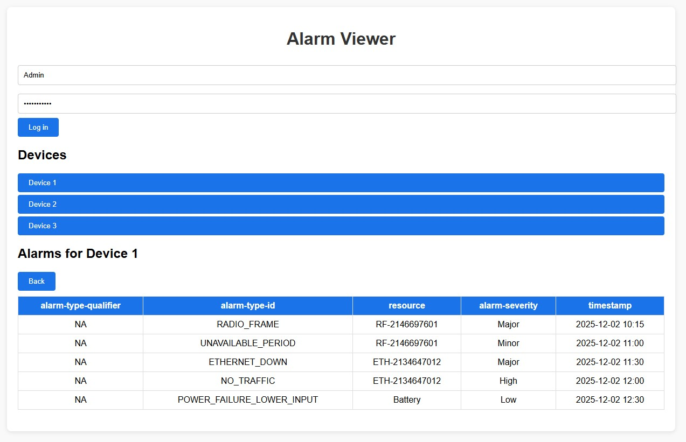
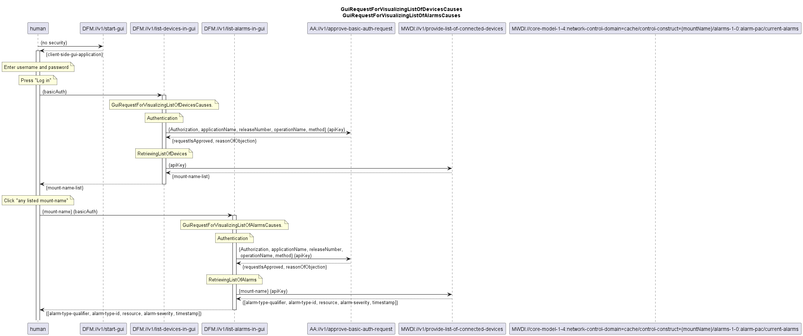

# Alarm Viewer GUI Workflow

This document describes the interaction flow for the **Alarm Viewer GUI**, which allows users to visualize connected devices and their associated alarms.

---

## **Overview**

The Alarm Viewer provides a simple interface for:
- Logging in with basic authentication.
- Viewing a list of connected devices.
- Selecting a device to view its current alarms.

The workflow involves multiple components interacting through REST APIs, as illustrated in the sequence diagram.

---

- **Login Section**: Username and password fields with a **Log in** button.
- **Devices Section**: Expandable list of connected devices.
- **Alarms Section**: Table showing alarms for the selected device.

---

## **Workflow Steps**

### **1. Start GUI**
- The user launches the GUI application (`DFM://v1/start-gui`).
- No security is required at this stage.

### **2. User Authentication**
- The user enters a username and password and clicks **Log in**.
- The GUI sends a request to `DFM://v1/list-devices-in-gui` using **Basic Authentication**.

### **3. Authorization**
- The request is validated via `AA://v1/approve-basic-auth-request` using an API key.
- The response includes:
  - `requestIsApproved`
  - `reasonOfObjection` (if any)

### **4. Retrieve Device List**
- Upon successful authentication, the GUI requests the list of connected devices from:
  - `MWDI://v1/provide-list-of-connected-devices`
- The response contains `{mount-name-list}` representing available devices.

### **5. Display Devices**
- The GUI displays the list of devices for user selection.

### **6. Retrieve Alarms for Selected Device**
- When the user clicks a device, the GUI sends a request to `DFM://v1/list-alarms-in-gui` with the selected `mount-name`.
- Authorization is again verified via `AA://v1/approve-basic-auth-request`.
- The GUI then retrieves alarms from:
  - `MWDI://core-model-1-4:network-control-domain=cache/control-construct={mountName}/alarms-1-0:alarm-pac/current-alarms`
- The response includes:
  - `[alarm-type-qualifier, alarm-type-id, resource, alarm-severity, timestamp]`

### **7. Display Alarms**
- The GUI displays alarms in a tabular format with columns:
  - **alarm-type-qualifier**
  - **alarm-type-id**
  - **resource**
  - **alarm-severity**
  - **timestamp**

---

## **Key Notes**
- **Security**: Basic Authentication for GUI requests; API key for backend authorization.
- **Data Flow**:
  - GUI → DFM → AA → MWDI
- **Error Handling**: Authorization failures return `reasonOfObjection`.

---

### ServiceList
- [DeviceFaultManagement+services](./DeviceFaultManagement+services.yaml)

### ProfileList and ProfileInstanceList
- [DeviceFaultManagement+profiles](./DeviceFaultManagement+profiles.yaml)
- [DeviceFaultManagement+profileInstances](./DeviceFaultManagement+profileInstances.yaml)

### ForwardingList
- [DeviceFaultManagement+forwardings](./DeviceFaultManagement+forwardings.yaml)

### Open API specification (Swagger)
- [DeviceFaultManagement](./DeviceFaultManagement.yaml)

### CONFIGfile (JSON)
- [DeviceFaultManagement+config](./DeviceFaultManagement+config.json)

### Comments
./.